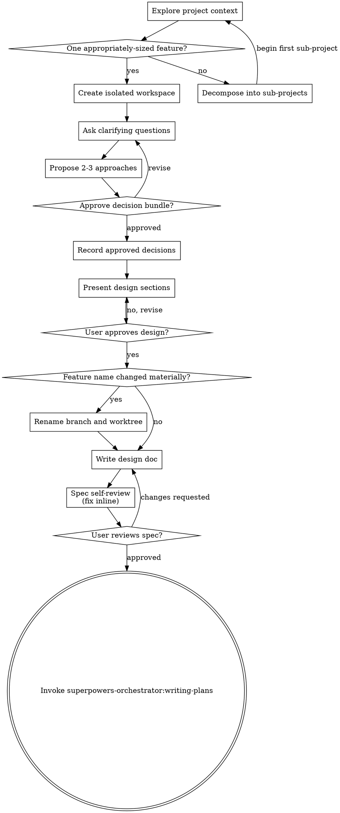

# Brainstorming Ideas Into Designs

Help turn ideas into fully formed designs and specs through natural collaborative dialogue.

Start by understanding the current project context, then ask questions one at a time to refine the idea. Once you understand what you're building, present the design and get user approval.

The token-cost boundary starts when this skill is announced. Before any other brainstorming action, capture the exact cumulative orchestrator counter scope and baseline when the harness exposes them. **Read `main:docs/superpower/manifest.json` and select the session entry matching the current workspace** by `workspace.type` and `workspace.target`; require exactly one session entry and preserve all others. A missing or duplicate match returns to the Session Gate. Initialize the active workflow run and write its ID to `brainstorming.workflow_id` in the selected entry, or reuse that ID and run directory on resume. Reuse an approved bundle only when all five decision fields are present; otherwise continue to the Human Gate without guessing missing values.

Every `D9` worker request and handoff must include: “Read main:docs/superpower/manifest.json before acting and select the entry matching the current workspace.”

<HARD-GATE>
Do NOT invoke any implementation skill, write any code, scaffold any project, or take any implementation action until you have presented a design and the user has approved it. This applies to EVERY project regardless of perceived simplicity.
</HARD-GATE>

## Anti-Pattern: "This Is Too Simple To Need A Design"

Every project goes through this process. A todo list, a single-function utility, a config change — all of them. "Simple" projects are where unexamined assumptions cause the most wasted work. The design can be short (a few sentences for truly simple projects), but you MUST present it and get approval.

## Checklist

You MUST create a task for each of these items and complete them in order:

1. **Explore project context and confirm scope** — check files, docs, recent commits, then collect graph context inline and best-effort before normal file exploration:
   - Resolve the graph path read-only: use `.ua/knowledge-graph.json` when present; otherwise use `.understand-anything/knowledge-graph.json` only when `.understand-anything/` exists. If neither graph exists, note `Knowledge graph missing or stale; continuing with file exploration.` and continue.
   - Compare `project.gitCommitHash` with `git log -1 --format=%H -- .`. If the graph is malformed, `git log` fails, or the hashes differ, note `Knowledge graph missing or stale; continuing with file exploration.` and continue.
   - When the graph is fresh, `grep_search` the graph for the feature keywords and seed context from matching node names, summaries, and edge targets. If there are no matches, continue normal file exploration without error.
   - Never call `/understand`, dispatch a worker, write the graph, or block normal file exploration from this collect step.
   - Assess scope — if the request describes multiple independent subsystems, decompose into sub-projects and restart this checklist for the first sub-project once it is scoped to one appropriately-sized feature; otherwise continue to item 2.
2. **Create isolated workspace** — after the scope check confirms one appropriately-sized feature and before asking any clarifying question:
   - Kebab-slugify approximately five words from the user's initial request and use the branch name `feature/<slug>`.
   - Invoke `superpowers-orchestrator:using-git-worktrees` with `<slug>` and continue in the workspace state it reports: created, reused, or working in place after declined consent or sandbox fallback; remember the reported workspace path for a possible rename in item 7.
   - If the request requires decomposition, create no workspace for the umbrella request. Start this step separately when brainstorming begins for each sub-project.
3. **Ask clarifying questions** — one at a time, establish the problem, scope, exclusions, constraints, and acceptance criteria
4. **Propose 2-3 approaches** — with trade-offs and your recommendation
5. **Human Gate — Design decisions** — present the settled `problem`, `scope`, `exclusions`, `approach`, and `acceptance_criteria` together. The human must explicitly approve or revise all five; permission to “choose for me” still requires presenting the resulting bundle for approval. Problem, scope, approach, and acceptance criteria must be non-empty; `exclusions` may be empty only when the human explicitly approves none. Write the approved bundle to `brainstorming` in the selected main-manifest session entry, preserving its `workflow_id` and every other session. **Do not present design sections or dispatch D9 until this approval is recorded.** If any decision changes later, return to this gate, update the record, and regenerate and reapprove all affected downstream design artifacts before continuing.
6. **Present design** — derive it from the approved decision bundle, in sections scaled to their complexity, and get user approval after each section
<!-- riso-tech:orchestrator-split START -->
7. **Write design doc** — before writing, compare the settled feature name with the slug used in item 2. If it changed materially, check for a destination collision with `git branch --list "feature/<new-slug>"`, then rename the branch with `git branch -m feature/<old-slug> feature/<new-slug>`; if the workspace was created via a native worktree tool, use that tool's own rename/move capability (or ask the human if it has none) and never use raw `git worktree move`; if created via the git fallback, run `git worktree move "<the-remembered-workspace-path>" "<new-path>"` and `cd` into the new path before continuing; ignore cosmetic or minor wording drift; surface any unrelated branch collision and do not overwrite it. Save to `docs/superpowers/features/<feature-slug>/design.md` following `skills/brainstorming/templates/spec-template.md`, generate `design.html` from `templates/document-companion-template.html`, add the feature to the product roadmap (see Documentation), and commit all
<!-- riso-tech:orchestrator-split END -->
8. **Spec self-review** — quick inline check for placeholders, contradictions, ambiguity, scope (see below)
9. **User reviews written spec** — ask user to review the spec file before proceeding
10. **Transition to implementation** — invoke `superpowers-orchestrator:writing-plans` to create implementation plan

## Process Flow



**The terminal state is invoking `superpowers-orchestrator:writing-plans`.** Do NOT invoke frontend-design, mcp-builder, or any other implementation skill. The ONLY skill you invoke after brainstorming is `superpowers-orchestrator:writing-plans`.

## The Process

<!-- riso-tech:orchestrator-split START -->
**Always inline:** the live conversation steps below (Understanding the idea, Exploring approaches, Presenting the design) never dispatch, regardless of provider availability — a dispatched worker never talks to the human.
<!-- riso-tech:orchestrator-split END -->

**Understanding the idea:**

- Check out the current project state first (files, docs, recent commits)
- Before asking detailed questions, assess scope: if the request describes multiple independent subsystems (e.g., "build a platform with chat, file storage, billing, and analytics"), flag this immediately. Don't spend questions refining details of a project that needs to be decomposed first.
- If the project is too large for a single spec, help the user decompose into sub-projects: what are the independent pieces, how do they relate, what order should they be built? Then brainstorm the first sub-project through the normal design flow. Each sub-project gets its own spec → plan → implementation cycle.
- For appropriately-scoped projects, ask questions one at a time to refine the idea
- Prefer multiple choice questions when possible, but open-ended is fine too
- Only one question per message - if a topic needs more exploration, break it into multiple questions
- Focus on understanding: purpose, constraints, success criteria

**Exploring approaches:**

- Propose 2-3 different approaches with trade-offs
- Present options conversationally with your recommendation and reasoning
- Lead with your recommended option and explain why

**Presenting the design:**

- Once you believe you understand what you're building, present the design
- Scale each section to its complexity: a few sentences if straightforward, up to 200-300 words if nuanced
- Ask after each section whether it looks right so far
- Cover: architecture, components, data flow, error handling, testing
- After the Architecture section is approved, judge from that approved content alone whether the feature has a user-facing surface. If it does, invoke `superpowers-orchestrator:designing-ui` as a sub-flow with the human before continuing to the remaining sections.
- Be ready to go back and clarify if something doesn't make sense

**Design for isolation and clarity:**

- Break the system into smaller units that each have one clear purpose, communicate through well-defined interfaces, and can be understood and tested independently
- For each unit, you should be able to answer: what does it do, how do you use it, and what does it depend on?
- Can someone understand what a unit does without reading its internals? Can you change the internals without breaking consumers? If not, the boundaries need work.
- Smaller, well-bounded units are also easier for you to work with - you reason better about code you can hold in context at once, and your edits are more reliable when files are focused. When a file grows large, that's often a signal that it's doing too much.

**Working in existing codebases:**

- Explore the current structure before proposing changes. Follow existing patterns.
- Where existing code has problems that affect the work (e.g., a file that's grown too large, unclear boundaries, tangled responsibilities), include targeted improvements as part of the design - the way a good developer improves code they're working in.
- Don't propose unrelated refactoring. Stay focused on what serves the current goal.

## After the Design

**Documentation:**

- Write the validated design to `docs/superpowers/features/<feature-slug>/design.md`
  - (User preferences for spec location override this default)
- Use elements-of-style:writing-clearly-and-concisely skill if available
- Commit the design document to git

<!-- riso-tech:orchestrator-split START -->
**Dispatch:** `D9` dispatches the approved design's spec, HTML companion, and roadmap through `superpowers-orchestrator:dispatch-agent` with the phase-matched role and phase-matched task_type — discovery → `role: business_analyst`, `task_type: discovery_research`; requirements → `role: product_owner`, `task_type: requirements_user_stories`; architecture → `role: tech_lead`, `task_type: architecture_design`; documentation/default → `role: technical_writer`, `task_type: documentation_knowledge_transfer`; the worker writes `docs/superpowers/features/<feature-slug>/design.md` from `templates/spec-template.md`, `design.html` from `templates/document-companion-template.html`, and `docs/superpowers/roadmap.json` conforming to `${CLAUDE_PLUGIN_ROOT}/assets/roadmap.schema.json` plus `docs/superpowers/ROADMAP.html` with one entry per User Story, following `${CLAUDE_PLUGIN_ROOT}/skills/brainstorming/roadmap.md` and starting from `${CLAUDE_PLUGIN_ROOT}/assets/roadmap.html` verbatim; the orchestrator validates all returned artifacts before presenting or committing them, and runs D9 inline only if the harness has no subagent capability at all.
<!-- riso-tech:orchestrator-split END -->

**Spec Self-Review:**
After writing the spec document, look at it with fresh eyes:

1. **Placeholder scan:** Any "TBD", "TODO", incomplete sections, or vague requirements? Fix them.
2. **Internal consistency:** Do any sections contradict each other? Does the architecture match the feature descriptions?
3. **Scope check:** Is this focused enough for a single implementation plan, or does it need decomposition?
4. **Ambiguity check:** Could any requirement be interpreted two different ways? If so, pick one and make it explicit.
<!-- riso-tech:orchestrator-split START -->
5. **Template check:** Does the spec follow `skills/brainstorming/templates/spec-template.md`? All "always" sections present, user stories numbered `US-n` with GIVEN/WHEN/THEN acceptance criteria, alternatives recorded, success criteria measurable.
<!-- riso-tech:orchestrator-split END -->

Fix any issues inline. No need to re-review — just fix and move on.

## Token-cost monitoring

Use `.superpowers/runs/<workflow-id>/brainstorming-token-cost.jsonl` for both sources. After every D9 provider attempt, append and validate one worker record, retaining retries, revisions, blocked results, and fallbacks:

```json
{"source":"worker","task":"D9","turn":1,"attempt":1,"agent":"codex","model":"<exact-model>","input_tokens":123,"output_tokens":45,"unavailable_reason":null}
```

`turn` is the D9 request envelope turn. `attempt` starts at 1 for that turn and increments only for provider fallbacks; a revision or blocked reroute uses the next request turn with attempt 1.

After each harness-reported main-orchestrator model invocation becomes observable, append and validate one orchestrator record before the next action; on resume continue at the highest recorded orchestrator turn plus one:

```json
{"source":"orchestrator","task":"orchestrator","turn":1,"attempt":1,"agent":"claude","model":"<exact-model>","input_tokens":456,"output_tokens":78,"unavailable_reason":null}
```

Copy exact per-invocation metadata. For comparable cumulative counters, use only monotonic snapshot deltas; after a reset, record nulls with the reason and retain the new baseline. Otherwise set unavailable counts to `null` with `unavailable_reason`. **Do not estimate missing token counts** or treat them as zero. Ordinary non-model tool calls are already included in orchestrator model usage and get no separate record.

Before rendering handoff, append its orchestrator record with null counts and reason `usage becomes visible only after this turn completes`. Report worker, orchestrator, and combined measured totals, partial columns, unavailable reasons, and coverage as measured records / total records for each source and combined. Never label a partial subtotal complete.

**User Review Gate:**
After the spec review loop passes, ask the user to review the written spec before proceeding:

> "Spec written and committed to `<path>`. Please review it and let me know if you want to make any changes before we start writing out the implementation plan."

Wait for the user's response. If they request changes, make them and re-run the spec review loop. Only proceed once the user approves.

If requested changes alter `problem`, `scope`, `exclusions`, `approach`, or `acceptance_criteria`, return to the Human Gate, update the selected session entry, and rerun D9 plus review; artifact approval alone cannot change an approved decision.

**Implementation:**

- **Before handoff, reread the selected session entry** from `main:docs/superpower/manifest.json`. Require `brainstorming.workflow_id` and non-missing approved values for all five decision fields, and verify the written design matches them. Return to the Human Gate on any mismatch.
- If `superpowers-orchestrator:designing-ui` ran during this session, invoke `superpowers-orchestrator:writing-plans` exactly once, referencing both this skill's `design.md` and the `designing-ui` spec. Otherwise, invoke it on this skill's `design.md` alone to create a detailed implementation plan.
- Do NOT invoke any other skill at this point. `superpowers-orchestrator:writing-plans` is the next step.

## Key Principles

- **One question at a time** - Don't overwhelm with multiple questions
- **Multiple choice preferred** - Easier to answer than open-ended when possible
- **YAGNI ruthlessly** - Remove unnecessary features from all designs
- **Explore alternatives** - Always propose 2-3 approaches before settling
- **Incremental validation** - Present design, get approval before moving on
- **Be flexible** - Go back and clarify when something doesn't make sense
