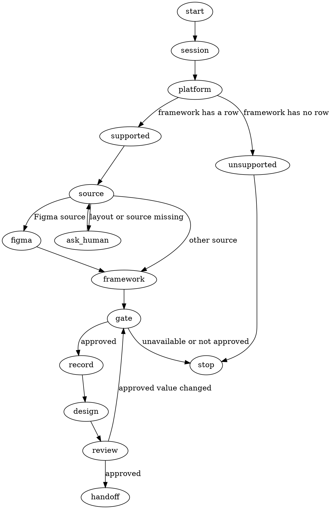

# Designing UI

Turn the feature's approved requirements into an approved UI decision record and written planning input. Do not implement UI in this skill.

The token-cost boundary starts when this skill is announced. Before any other action, capture the exact cumulative orchestrator counter scope and baseline when the harness exposes them. **Read `main:docs/superpower/manifest.json` and select the session entry matching the current workspace** by `workspace.type` and `workspace.target`; require exactly one session entry and preserve all others. A missing or duplicate match stops at the Session Gate. Reuse `designing_ui.workflow_id` and its run directory on resume. Otherwise use the calling workflow's ID when present, or initialize a workflow ID for a direct invocation, and write it to `designing_ui.workflow_id` in the selected entry.

Every return or handoff must include: “Read main:docs/superpower/manifest.json before acting and select the entry matching the current workspace.”

<HARD-GATE>
Do not write planning inputs or hand off until this approval is recorded. Silence is not approval.
</HARD-GATE>

## Platform

Detect the platform in this order; the first result wins:

1. Inspect installed project files: `package.json` dependencies, Electron configuration, `tsconfig.json`, Xcode projects, and framework files.
2. If no project files identify it, read `docs/superpowers/project/scaffold-design.md`.
3. If still unknown, ask the human: “What stack/platform is this project?”

Installed project files override a conflicting scaffold document.

| Framework | Reference |
| --- | --- |
| React | [references/react-reui.md](references/react-reui.md) |

For a framework without a row, say it is not supported yet, hand off to `superpowers-orchestrator:brainstorming`, and write no UI code. Extend this map with one row and one reference file per supported framework.

## UI decision bundle

Resolve the layout and source. If neither is supplied, ask the human. For a Figma reference, use `get_metadata` for hierarchy and `get_screenshot` for visual reference before proposing the bundle. If the human is unavailable or does not reply, present what awaits approval and stop; silence is not approval.

Follow the selected framework reference to resolve the component approach. Then present:

```text
Platform: <detected platform/framework>
Layout: <sections, hierarchy, and arrangement>
Source: <human description | existing page/component path | Figma file/node reference>
Component approach: <approved registry/toolchain | native platform primitives>
Constraints: <responsive, accessibility, brand/design-system, and other UI constraints>
```

### Human Gate — UI decisions and constraints

The human must explicitly approve or revise `platform`, `layout`, `source`, `component_approach`, and `constraints` together. Permission to choose does not approve the resulting values. The first four fields must be non-empty; `constraints` may be empty only when the human explicitly approves none.

Write the approved bundle under `designing_ui` in the selected main-manifest session, preserving its `workflow_id` and every other session. **Do not write planning inputs or hand off until this approval is recorded.** If any approved value changes later, return to this gate, update the record, and regenerate and reapprove the affected written design before continuing.

After recording approval, write the UI design to `docs/superpowers/features/<feature-slug>/design.md` or the caller-provided UI spec path and present it for human approval. The spec must match the approved record.

## Checklist

1. Capture the token-cost boundary and select exactly one matching workspace session.
2. Reuse or initialize `designing_ui.workflow_id` in that session.
3. Detect the platform from project files, then scaffold documentation, then the human.
4. Hand off unsupported frameworks to brainstorming and write no UI code.
5. Resolve the layout and source; read Figma metadata and screenshot when applicable.
6. Follow the framework reference and resolve the component approach.
7. Present the five-field UI decision bundle.
8. Obtain explicit approval of all five fields together and record the approved bundle.
9. Write and present the UI design; return to the gate when an approved value changes.
10. Verify the approved session and written design before the direct or sub-flow handoff.

## Process Flow



## The Process

### Session and platform

Start the token-cost boundary, read `main:docs/superpower/manifest.json`, and select exactly one session matching the current workspace. Reuse `designing_ui.workflow_id` on resume or initialize one for a direct invocation. Detect the platform from installed project files first, then the scaffold document, then the human.

### Source and framework

Resolve the layout and source, asking the human when neither is supplied. For a Figma reference, use `get_metadata` for hierarchy and `get_screenshot` for visual reference. Follow the selected framework reference to resolve the component approach. If the framework has no row, say it is unsupported, hand off to `superpowers-orchestrator:brainstorming`, and write no UI code.

### UI decision gate

Present `platform`, `layout`, `source`, `component_approach`, and `constraints` together. The human must explicitly approve or revise the complete bundle; permission to choose does not approve the resulting values, and silence is not approval. Record the approved bundle under `designing_ui`, preserving its `workflow_id` and every other session. Do not write planning inputs or hand off until this approval is recorded.

### Written design and handoff

After approval, write the UI design to the feature design path or caller-provided UI spec path and present it for human approval. The spec must match the approved record. If an approved value changes, return to the gate, update the record, and regenerate and reapprove the affected design. Before handoff, reread the selected session, verify all five approved values and the matching design, then invoke `writing-plans` exactly once for a direct invocation or return the path and token-cost report to the calling skill for a sub-flow.

## After the UI Design

The approved bundle is written under `designing_ui` in the selected main-manifest session, and the written UI design is saved to `docs/superpowers/features/<feature-slug>/design.md` or a caller-provided UI spec path. Before returning or invoking `writing-plans`, verify that the complete approved bundle matches the written design.

## Token-cost Monitoring

Use `.superpowers/runs/<workflow-id>/designing-ui-token-cost.jsonl`. After each harness-reported main-orchestrator model invocation becomes observable, append and validate one record before the next action; on resume continue at the highest recorded turn plus one:

```json
{"source":"orchestrator","task":"orchestrator","turn":1,"attempt":1,"agent":"claude","model":"<exact-model>","input_tokens":456,"output_tokens":78,"unavailable_reason":null}
```

Copy exact per-invocation metadata. For comparable cumulative counters, use only monotonic snapshot deltas; after a reset, record nulls with the reason and retain the new baseline. Otherwise set unavailable counts to `null` with `unavailable_reason`. **Do not estimate missing token counts** or treat them as zero. Figma, ReUI, and other ordinary non-model tool calls are included in orchestrator model usage and get no separate record.

Before rendering the final return or handoff, append its orchestrator record with null counts and reason `usage becomes visible only after this turn completes`. Report measured totals, unavailable reasons, and coverage as measured records / total records. Never label a partial subtotal complete.

## Red Flags

- **Silence or an unavailable human** — silence is not approval.
- **Permission to choose** — permission to choose does not approve the resulting values.
- **A changed approved value** — return to the Human Gate and regenerate and reapprove the affected written design.

## Completion

Before handoff, reread the selected session entry from `main:docs/superpower/manifest.json`. Require `designing_ui.workflow_id` and non-missing approved values for all five fields, and verify the written design matches them. Return to the Human Gate on any mismatch.

Direct invocation: after the written design is approved, invoke `superpowers-orchestrator:writing-plans` exactly once with the UI design path and the workspace-aware manifest instruction.

Sub-flow invocation: after the written design is approved, return its path, token-cost report, and the workspace-aware manifest instruction to the calling skill; it invokes `superpowers-orchestrator:writing-plans` exactly once when its flow finishes.

## Key Principles

- **Detect the platform in order** — installed project files override the scaffold document.
- **Approve the bundle together** — the human explicitly approves or revises all five UI decisions together.
- **Silence is not approval** — do not write planning inputs or hand off until approval is recorded.
- **Match the written design** — the spec must match the approved record.
- **Return to the gate on change** — update the record and regenerate and reapprove the affected design.
