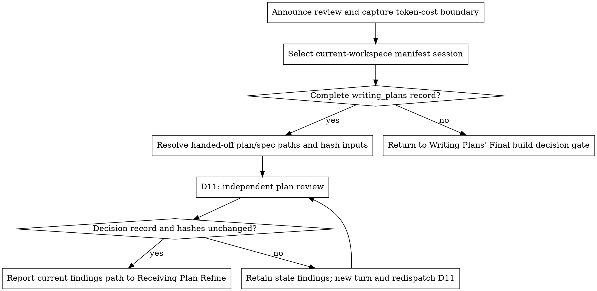

<!-- riso-tech:orchestrator-split — new skill, no upstream counterpart -->

# Requesting Plan Refine

Dispatch a fresh, context-free subagent to review a written implementation
plan before execution — surfacing gaps, ambiguity, and structural issues the
planning agent may not see in its own work.

<HARD-GATE>
The requesting phase never edits the plan or changes an approved decision.
</HARD-GATE>

## Checklist

1. Announce the independent review and capture the token-cost boundary.
2. Select exactly one current-workspace manifest session and require its complete `writing_plans` record.
3. Use the exact handed-off plan and spec paths inside the current workspace root; snapshot and hash them.
4. Create a fresh findings path and dispatch D11 with the selected decision snapshot and artifact identities.
5. Reread the selected session entry and rehash the artifacts; retain stale findings and redispatch D11 when they changed.
6. Append the required token-cost records and hand the current findings path to Receiving Plan Refine exactly once.

## Process Flow



## The Process

### Start the review boundary

**Core principle:** A plan is safest to execute after someone other than its
author has read it critically.

**Announce at start:** "I'm using the requesting-plan-refine skill to get an
independent review of the plan."

The token-cost boundary starts when this skill is announced. Before any other review action, capture the exact cumulative orchestrator counter scope and baseline when the harness exposes them.

### Select the approved plan record

**Read `main:docs/superpower/manifest.json` and select the session entry matching the current workspace** by `workspace.type` and `workspace.target`; require exactly one session entry and preserve every session entry. A missing or duplicate match returns to the Session Gate.

Require `writing_plans.workflow_id` plus approved `scope`, `exclusions`, `ordering`, `files`, `interfaces`, `tests`, and `verification` in the selected entry. Use that workflow ID as the active run; do not trust a conflicting ambient run ID. A partial record returns to Writing Plans' Final build decision gate.

Use only the exact plan and spec paths from the current Writing Plans handoff. Resolve both inside the current workspace root and reject any path outside it. On resume, recover the paths from that selected run's handoff evidence; if they are unavailable, return to Writing Plans instead of guessing or searching another workspace.

Every D11 request and handoff must include: “Read main:docs/superpower/manifest.json before acting and select the entry matching the current workspace.”

### Prepare and dispatch D11

<!-- riso-tech:orchestrator-split START -->
**Dispatch:** `D11` — Dispatch the plan reviewer via `superpowers-orchestrator:dispatch-agent` for an independent plan review with `role: tech_lead`, `task_type: code_review_quality`, the current workspace, approved `writing_plans` snapshot, plan/spec paths and content hashes, and the plan's `author_agent` from the active run's `ledger.jsonl`; fill [plan-reviewer.md](prompts/plan-reviewer.md), save each review under the active run's `30-plan/plan-refine/`, enforce provider diversity, and when `superpowers-orchestrator:receiving-plan-refine` requests another refine loop, re-dispatch D11 against the revised plan and current decision snapshot until the human chooses Execute.
<!-- riso-tech:orchestrator-split END -->

**1. Locate the plan (and spec, if any):**

```bash
PLAN_FILE=<exact-plan-path-from-writing-plans-handoff>
SPEC_FILE=<exact-spec-path-from-writing-plans-handoff-or-none>
```

Require the plan; use `None — no spec was written for this plan` only when the approved plan record has no spec input.

**2. Capture the review snapshot:** retain the exact selected `writing_plans` object and current workspace key, then hash the plan and any spec with `git hash-object -- <path>`. These values identify the inputs D11 actually reviewed.

**3. Prepare the scratch workspace:**

```bash
root=$(git rev-parse --show-toplevel)
dir=$(node "$CLAUDE_PLUGIN_ROOT/scripts/run-paths.mjs" task \
  --root "$root" --run "$WORKFLOW_ID" --phase plan --task plan-refine)
mkdir -p "$dir"
```

Use a fresh findings path for every review turn: `<run>/30-plan/plan-refine/findings-<turn>.md`. Never overwrite prior review evidence.

**4. Dispatch a subagent, filling the template at [plan-reviewer.md](prompts/plan-reviewer.md):**

**Placeholders:**
- `{PLAN_FILE}` - path to the plan
- `{SPEC_FILE}` - path to the spec, or "None — no spec was written for this
  plan" if absent
- `{WORKSPACE_ROOT}` - current workspace root containing the plan and spec
- `{WORKSPACE_TYPE}` and `{WORKSPACE_TARGET}` - selected session key
- `{APPROVED_DECISION_RECORD}` - exact selected `writing_plans` snapshot
- `{PLAN_HASH}` and `{SPEC_HASH}` - dispatched artifact identities
- `{FINDINGS_FILE}` - unique findings path for this review turn

### Validate current review inputs

**5. Receive and validate the result:** the subagent returns only the findings file path and a one-line summary — never paste findings text into your own context. **Before handoff, reread the selected session entry**, compare its complete `writing_plans` object with the dispatched snapshot, and rehash the plan and spec. If any value or hash changed, retain the findings as stale evidence, do not hand it off, and redispatch D11 with a new turn, findings path, and current snapshot.

## After the Artifact

**User Review Gate:**
After a current review, report to the user:

> "Review complete and saved to `<run>/30-plan/plan-refine/findings-<turn>.md`."

Invoke `superpowers-orchestrator:receiving-plan-refine` exactly once with the selected workspace key, workflow ID, current decision snapshot, plan/spec paths and hashes, findings path, and token-cost report.

## Token-cost Monitoring

Use `.superpowers/runs/<workflow-id>/requesting-plan-refine-token-cost.jsonl` for both sources. After every D11 provider call, append and validate one worker record, retaining retries, revisions, blocked results, and fallbacks:

```json
{"source":"worker","task":"D11","turn":1,"attempt":1,"agent":"codex","model":"<exact-model>","input_tokens":123,"output_tokens":45,"unavailable_reason":null}
```

`turn` identifies one review request for one plan/decision snapshot. `attempt` starts at 1 and increments for every same-turn provider call, including same-provider retries and fallbacks. A revised plan, changed snapshot, blocked reroute, or stale result uses the next turn with attempt 1.

After each harness-reported main-orchestrator invocation becomes observable, append and validate one orchestrator record before the next action; on resume continue at the highest recorded turn plus one:

```json
{"source":"orchestrator","task":"orchestrator","turn":1,"attempt":1,"agent":"claude","model":"<exact-model>","input_tokens":456,"output_tokens":78,"unavailable_reason":null}
```

Copy exact per-invocation metadata. For comparable cumulative counters, use only monotonic snapshot deltas; after a reset, record nulls with the reason and retain the new baseline. Otherwise set unavailable counts to `null` with `unavailable_reason`. **Do not estimate missing token counts** or treat them as zero. Ordinary non-model tool calls are included in orchestrator usage and get no separate record.

Before rendering the receiving handoff, append its orchestrator record with null counts and reason `usage becomes visible only after this turn completes`. Report worker, orchestrator, and combined measured totals, unavailable reasons, and coverage as measured records / total records for each source and combined. A measured record has both counts; report input-field and output-field coverage independently. Never label a partial subtotal complete.

## Red Flags

**Never:**
- Read the plan yourself and call it a review — the value is a fresh,
  independent read
- Paste the subagent's full findings into your own context — pass the file
  path instead
- Skip dispatching because "the plan looks fine" — that's the planning
  agent's own bias
- Treat a proposed decision change as an ordinary plan fix
- Hand off findings after the decision record, plan, or spec has changed

## Key Principles

**Independent review** — A plan is safest to execute after someone other than its author has read it critically.

**Current inputs** — Use only the exact plan and spec paths from the current Writing Plans handoff.

**Fresh evidence** — Use a fresh findings path for every review turn. Never overwrite prior review evidence.

**Approved decisions** — The requesting phase never edits the plan or changes an approved decision.
