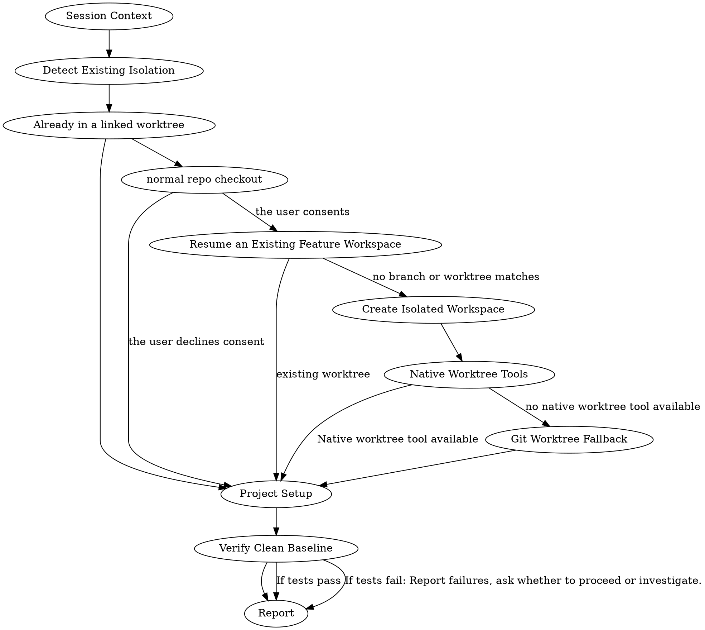

# Using Git Worktrees

Ensure work happens in an isolated workspace. Prefer your platform's native worktree tools. Fall back to manual git worktrees only when no native tool is available.

**Core principle:** Detect existing isolation first. Then use native tools. Then fall back to git. Never fight the harness.

**Announce at start:** "I'm using the using-git-worktrees skill to set up an isolated workspace."

The token-cost boundary starts when this skill is announced. Capture the exact cumulative orchestrator counter scope and baseline when the harness exposes them.

<HARD-GATE>
Has the user already indicated their worktree preference in your instructions? If not, ask for consent before creating a worktree:

> "Would you like me to set up an isolated worktree? It protects your current branch from changes."
</HARD-GATE>

## Anti-Pattern: "Fighting the harness"

- **Problem:** Using `git worktree add` when the platform already provides isolation
- **Fix:** Step 0 detects existing isolation. Step 1a defers to native tools.

## Checklist

1. Announce the skill and capture the token-cost boundary.
2. Select the caller's session and active workflow ID.
3. Detect existing isolation and obtain consent when needed.
4. Resume the exact selected feature workspace when one exists.
5. Create the selected isolated workspace with a native tool or the Git fallback.
6. Run project setup and verify the clean baseline.
7. Validate and report the workspace handoff.

## Process Flow



## The Process

### Session Context

The caller supplies the selected session key and its active workflow ID:

```text
DECISION_RECORD=main:docs/superpower/manifest.json
WORKFLOW_ID=<caller-workflow-id>
```

**Read `main:docs/superpower/manifest.json`** and require exactly one session entry selected by `workspace.type` and `workspace.target`. The selected entry must contain the caller's workflow ID. This skill must not initialize or replace either value, edit the manifest, or copy it into the worktree; preserve every other session entry.

Git branches and worktrees are the source of truth for whether a session can resume. The selected manifest entry determines which Git workspace to inspect or create; slug matches and ambient run IDs never override it. If no exact session was selected, return to the Session Gate in `superpowers-orchestrator:using-superpowers` rather than guessing.

Every D12 request and downstream handoff must say: “Read main:docs/superpower/manifest.json before acting and select the entry matching the current workspace.”

### Step 0: Detect Existing Isolation

**Before creating anything, check if you are already in an isolated workspace.**

```bash
GIT_DIR=$(cd "$(git rev-parse --git-dir)" 2>/dev/null && pwd -P)
GIT_COMMON=$(cd "$(git rev-parse --git-common-dir)" 2>/dev/null && pwd -P)
BRANCH=$(git branch --show-current)
```

**Submodule guard:** `GIT_DIR != GIT_COMMON` is also true inside git submodules. Before concluding "already in a worktree," verify you are not in a submodule:

```bash
# If this returns a path, you're in a submodule, not a worktree — treat as normal repo
git rev-parse --show-superproject-working-tree 2>/dev/null
```

**If `GIT_DIR != GIT_COMMON` (and not a submodule):** You are already in a linked worktree. Skip to Step 2 (Project Setup). Do NOT create another worktree.

Before reuse, normalize the current worktree root and selected `workspace.target`; require them to identify the same path and require `WORKFLOW_ID` to remain present in that session entry. A mismatch returns to the Session Gate.

Report with branch state:
- On a branch: "Already in isolated workspace at `<path>` on branch `<name>`."
- Detached HEAD: "Already in isolated workspace at `<path>` (detached HEAD, externally managed). Branch creation needed at finish time."

**If `GIT_DIR == GIT_COMMON` (or in a submodule):** You are in a normal repo checkout.

Has the user already indicated their worktree preference in your instructions? If not, ask for consent before creating a worktree:

> "Would you like me to set up an isolated worktree? It protects your current branch from changes."

Honor any existing declared preference without asking. If the user declines consent, work in place and skip to Step 2.

A human-confirmed selected worktree session is standing consent for its exact target. If the selected session is a branch and the human now wants a worktree, return to the Session Gate to establish that worktree identity; do not repurpose the branch entry or change `WORKFLOW_ID` here.

### Step 0.5: Resume an Existing Feature Workspace

After Step 0 determines that this is a normal checkout and the user consents, if the caller supplied `<slug>`, inspect existing worktrees and matching feature branches before creating anything:

```bash
git worktree list
git branch --list "feature/<slug>*"
```

When a session is selected, its exact branch/worktree target wins. Classify only that target; report other slug matches as unrelated and do not ask the human to reselect work already chosen at the Session Gate. A missing worktree directory may be recreated only from the selected entry's existing unmerged Git branch and only at its selected target.

For each matching branch found, classify it with these exact checks, in order:

```bash
# 1. Is it already merged into main?
git merge-base --is-ancestor "$MATCHED_BRANCH" main && echo merged || echo unmerged

# 2. If unmerged, does it have the feature's design document?
git cat-file -e "$MATCHED_BRANCH:docs/superpowers/features/<slug>/design.md" 2>/dev/null && echo present || echo absent
```

- If `git merge-base --is-ancestor "$MATCHED_BRANCH" main` exits `0`, the branch is already merged into `main`: report it as stale or finished, do not reuse it, delete it with `git branch -d "$MATCHED_BRANCH"`, then continue to Step 1's fresh-creation path.
- If the exact selected branch is unmerged, it is the only eligible resume branch; design-document presence is context, not authority. If `git worktree list` shows it already attached at the selected target, enter it. If only the branch remains because its worktree was deleted or pruned, run `git worktree prune`, then let D12 recreate that branch at the exact selected target without `-b`; only the no-subagent fallback follows Step 1b inline.
- Treat every slug match other than the selected branch as unrelated, regardless of design-document presence. Report it without reopening session selection.
- If multiple branches match the slug, continue with the exact selected branch and report the others. If no exact session was selected, return to the Session Gate. Never guess.
- If no branch or worktree matches, continue to Step 1 unchanged.

<!-- riso-tech:orchestrator-split START -->
**Dispatch:** `D12` runs only when Step 0 confirms isolation is needed, the human or standing instructions consent, and Step 0.5 did not enter an existing worktree: dispatch worktree creation or recreation through `superpowers-orchestrator:dispatch-agent` with `role: devops_engineer` and `task_type: workspace_setup`; pass `WORKFLOW_ID` and `DECISION_RECORD`, selected workspace tuple, branch, exact target, and constraints; require `output.artifacts` to contain the created worktree path and return both values unchanged. Verify the path and Git registration match the selected target; any path, workflow, or decision-record mismatch is blocked before `cd`. Continue with exactly one `cd`, setup, and baseline tests only after validation; resolve inline only if the harness has no subagent capability at all.
<!-- riso-tech:orchestrator-split END -->

### Step 1: Create Isolated Workspace

Use the branch and exact target from the selected session. When the caller supplied `<slug>`, `feature/<slug>` must match that selected branch; otherwise return to the Session Gate instead of inventing or renaming session identity.

**You have two mechanisms. Try them in this order.**

### 1a. Native Worktree Tools (preferred)

The user has asked for an isolated workspace (Step 0 consent). Do you already have a way to create a worktree? It might be a tool with a name like `EnterWorktree`, `WorktreeCreate`, a `/worktree` command, or a `--worktree` flag. If you do, use it and skip to Step 2.

Native tools handle directory placement, branch creation, and cleanup automatically. Using `git worktree add` when you have a native tool creates phantom state your harness can't see or manage.

Only proceed to Step 1b if you have no native worktree tool available.

### 1b. Git Worktree Fallback

**Only use this if Step 1a does not apply** — you have no native worktree tool available. Create a worktree manually using git.

#### Directory Selection

Follow this priority order. Explicit user preference always beats observed filesystem state.

1. **Check your instructions for a declared worktree directory preference.** If the user has already specified one, set `LOCATION` to it without asking. An explicit custom location inside the project root is project-local and must pass the safety verification below; if it is absolute, normalize `LOCATION` to a repository-relative path before continuing so both `git check-ignore` and `.gitignore` use the same path. A global location outside the project root remains absolute and does not use the repository ignore check.

   For a selected worktree session, its exact `workspace.target` is authoritative; directory preferences may validate that target but may not replace it.

2. **Check for an existing project-local worktree directory:**
   ```bash
   ls -d .worktrees 2>/dev/null     # Preferred (hidden)
   ls -d worktrees 2>/dev/null      # Alternative
   ```
   If found, set `LOCATION` to it. If both exist, `.worktrees` wins.

3. **If there is no other guidance available**, default to `.worktrees/` at the project root by setting `LOCATION=.worktrees`.

#### Safety Verification (project-local directories only)

**MUST verify the selected project-local directory is ignored before creating the worktree.** This includes explicit custom project-local preferences. Native tools already exited at Step 1a, and a global `LOCATION` outside the project root skips this repository ignore check.

```bash
git check-ignore -q -- "$LOCATION/"
```

Validate only `$LOCATION/`; never OR-check candidate directories that were not selected.

**If NOT ignored:** Add `$LOCATION/` to `.gitignore`, commit the change, then proceed.

**Why critical:** Prevents accidentally committing worktree contents to repository.

#### Create the Worktree

```bash
# Determine path based on chosen location
path="$LOCATION/$BRANCH_NAME"

git worktree add "$path" -b "$BRANCH_NAME"
cd "$path"
```

**Sandbox fallback:** If `git worktree add` fails with a permission error (sandbox denial), tell the user the sandbox blocked worktree creation and you're working in the current directory instead. Then run setup and baseline tests in place.

Proceed in place only when the current branch/worktree still matches the selected session. Otherwise stop at the Session Gate; never carry the selected workflow ID into a different workspace.

### Step 2: Project Setup

Auto-detect and run appropriate setup:

```bash
# Node.js
if [ -f package.json ]; then npm install; fi

# Rust
if [ -f Cargo.toml ]; then cargo build; fi

# Python
if [ -f requirements.txt ]; then pip install -r requirements.txt; fi
if [ -f pyproject.toml ]; then poetry install; fi

# Go
if [ -f go.mod ]; then go mod download; fi
```

### Step 3: Verify Clean Baseline

Run tests to ensure workspace starts clean:

```bash
# Use project-appropriate command
npm test / cargo test / pytest / go test ./...
```

**If tests fail:** Report failures, ask whether to proceed or investigate.

**If tests pass:** Report ready.

### Quick Reference

| Situation | Action |
|-----------|--------|
| Already in linked worktree | Skip creation (Step 0) |
| In a submodule | Treat as normal repo (Step 0 guard) |
| Native worktree tool available | Use it; skip manual ignore validation (Step 1a) |
| No native tool | Git worktree fallback (Step 1b) |
| `.worktrees/` exists | Use it (verify ignored) |
| `worktrees/` exists | Use it (verify ignored) |
| Both exist | Use `.worktrees/` |
| Neither exists | Check instruction file, then default `.worktrees/` |
| Custom project-local preference | Use it; validate exactly `$LOCATION/` |
| Global location outside project root | Use it; skip repository ignore validation |
| Selected directory not ignored | Add `$LOCATION/` to `.gitignore` + commit |
| Permission error on create | Sandbox fallback, work in place |
| Tests fail during baseline | Report failures + ask |
| No package.json/Cargo.toml | Skip dependency install |

### Common Mistakes

#### Skipping detection

- **Problem:** Creating a nested worktree inside an existing one
- **Fix:** Always run Step 0 before creating anything

#### Skipping ignore verification

- **Problem:** Worktree contents get tracked, pollute git status
- **Fix:** Run `git check-ignore -q -- "$LOCATION/"` for the selected project-local location, including custom preferences

#### Assuming directory location

- **Problem:** Creates inconsistency, violates project conventions
- **Fix:** Follow priority: explicit instructions > existing project-local directory > default

#### Proceeding with failing tests

- **Problem:** Can't distinguish new bugs from pre-existing issues
- **Fix:** Report failures, get explicit permission to proceed

## After the Artifact

Before reporting ready, reread the main manifest after entering the workspace and select exactly one entry matching the actual branch/worktree. Require it to be the original selected entry and require `WORKFLOW_ID` and `DECISION_RECORD` to remain unchanged. This skill never writes the manifest.

### Report

```
Worktree ready at <full-path>
Workspace: <workspace.type>:<workspace.target>
Workflow: <WORKFLOW_ID>
Decision record: main:docs/superpower/manifest.json
Tests passing (<N> tests, 0 failures)
Token cost: <worker/orchestrator/combined totals and coverage>
Ready to implement <feature-name>
```

Pass this complete context unchanged to the calling planning/execution workflow. A blocked, declined-consent, or in-place fallback report uses the same workspace/workflow/decision-record fields and token-cost report.

## Token-cost Monitoring

Use `.superpowers/runs/<workflow-id>/using-git-worktrees-token-cost.jsonl`. After every D12 provider call, append and validate one worker record, retaining retries, fallbacks, blocked results, and resumed attempts:

```json
{"source":"worker","task":"D12","turn":1,"attempt":1,"agent":"codex","model":"<exact-model>","input_tokens":123,"output_tokens":45,"unavailable_reason":null}
```

`turn` identifies one selected workflow/workspace request. `attempt` increments for every provider call on that request, including retries, fallbacks, and resume after interruption. A human-approved target or workflow change starts the next turn at attempt 1.

After each harness-reported main-orchestrator invocation becomes observable, append and validate one orchestrator record before the next action; on resume continue after the highest recorded orchestrator turn:

```json
{"source":"orchestrator","task":"orchestrator","turn":1,"attempt":1,"agent":"claude","model":"<exact-model>","input_tokens":456,"output_tokens":78,"unavailable_reason":null}
```

Copy exact per-invocation metadata. Use monotonic cumulative-counter deltas only; after a reset, record affected counts as `null` with the reason and retain the new baseline. Otherwise keep unavailable fields `null` with a reason. **Do not estimate missing token counts** or treat them as zero. Ordinary non-model tool calls are included in orchestrator usage and get no separate record.

Before rendering the ready/blocked handoff, append its orchestrator record with both counts `null` and reason `usage becomes visible only after this turn completes`. Report worker, orchestrator, and combined measured totals, unavailable reasons, full-record coverage as measured records / total records, and input/output field coverage independently. Never call a partial subtotal complete.

## Red Flags

**Never:**
- Create a worktree when Step 0 detects existing isolation
- Use `git worktree add` when you have a native worktree tool (e.g., `EnterWorktree`). This is the #1 mistake — if you have it, use it.
- Skip Step 1a by jumping straight to Step 1b's git commands
- Create worktree without verifying the selected `$LOCATION/` is ignored (project-local)
- Skip baseline test verification
- Proceed with failing tests without asking

**Always:**
- Run Step 0 detection first
- Prefer native tools over git fallback
- Follow directory priority: explicit instructions > existing project-local directory > default
- Verify exactly the selected `$LOCATION/` is ignored for project-local locations
- Auto-detect and run project setup
- Verify clean test baseline

## Key Principles

**Existing isolation** — Detect existing isolation first.

**Native tools** — Then use native tools.

**Git fallback** — Then fall back to git.

**Session identity** — The selected manifest entry determines which Git workspace to inspect or create; slug matches and ambient run IDs never override it.

**Clean baseline** — If tests fail: Report failures, ask whether to proceed or investigate.
